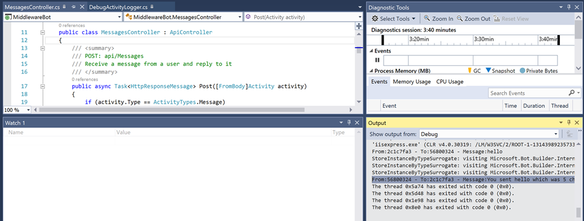

# Activity Logger

## 1. Objectives

This lab is aimed at getting started with logging using the Microsoft Bot Framework. Specifically, in this lab, we will demonstrate how you can log conversations using an activity logger. Logging in this lab is performed using Debug.

## 2. Setup

Import the core-Middleware code from https://github.com/Microsoft/BotBuilder-Samples/tree/master/CSharp/core-Middleware in Visual Studio. The easiest way to perform this is opening core-Middleware.sln. The solution explorer would look as follows in Visual Studio:


## 3. IActivityLogger

One of the most common operations when working with conversational history is to intercept and log message activities between bots and users. The IActivityLogger interface contains the definition of the functionality that a class needs to implement to log message activities. The DebugActivityLogger implementation of the IActivityLogger interface writes message activities to the trace listeners only when running in debug.

````C#
public class DebugActivityLogger : IActivityLogger
{
    public async Task LogAsync(IActivity activity)
    {
        Debug.WriteLine($"From:{activity.From.Id} - To:{activity.Recipient.Id} - Message:{activity.AsMessageActivity().Text}");
    }
}
````
The logging activity is an event that takes place for the lifetime of the bot application. Application_Start method is called when the application starts and lasts for the lifetime of the application.

Global.asax allows us to write event handlers that react to important life-cycle events. Global.asax events are never called directly by the user. They are called automatically in response to application events. For this lab, we must register DebugActivityLogger in Application_Start (in Global.asax) as follows.

````C#
protected void Application_Start()
{
    Conversation.UpdateContainer(builder =>
    {
        builder.RegisterType<DebugActivityLogger>().AsImplementedInterfaces().InstancePerDependency();
    });
    GlobalConfiguration.Configure(WebApiConfig.Register);
}
````

The Application_Start method is called only one time during the life cycle of an application. You can use this method to perform startup tasks.

## 4. Log Results

Run the bot application and test in the emulator with messages. The log data is written using Debug.WriteLine. You can view the result using Output window. Ensure Debug is selected for *Show output from*. If Output is not visible, select View->Output from the menu. You will see an entry such as ````From:56800324 - To:2c1c7fa3 - Message:hello````. Since this is an echo bot, you will also see the echoed message logged.

